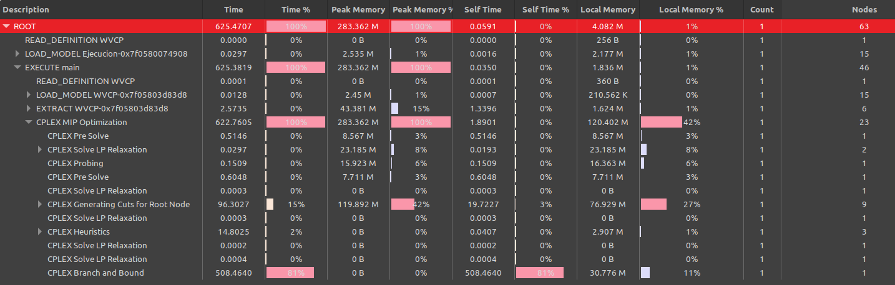

# Informe tercera entrega del TP
En esta sección se desarrollarán cada uno de los pasos indicados para la tercera entrega del TP.

## Paso 1
Al correr mi heurística sobre este tercer problema, obtuve el siguiente output:
```
$ time ./ejecutar.sh tercer
Lavado 1 -> Tiempo: 20
Lavado 2 -> Tiempo: 19
Lavado 3 -> Tiempo: 14
Lavado 4 -> Tiempo: 13
Lavado 5 -> Tiempo: 12
Lavado 6 -> Tiempo: 11
Lavado 7 -> Tiempo: 9
Lavado 8 -> Tiempo: 9
Lavado 9 -> Tiempo: 8
Lavado 10 -> Tiempo: 5
Lavado 11 -> Tiempo: 3
Tiempo total de lavado: 123
Cantidad total de lavados: 11

real    0m0,023s
user    0m0,017s
sys     0m0,006s
```
Como podemos ver la ejecución del script tardó 0.023s y arrojó un tiempo total de lavado de todas las prendas de 123 (sumatoria de los tiempos de cada lavado formado). Y la cantidad total de lavados armados fue de 11.

## Paso 2
Se corre el modelo de la materia en CPLEX.
Luego de 10 minutos de ejecución podemos ver que el header del output de la sección Engine Log mostró lo siguiente:
```
1 Version identifier: 22.1.1.0 | 2022-11-28 | 9160aff4d
2 Legacy callback                                  pi
3 Tried aggregator 1 time.
4 MIP Presolve eliminated 120467 rows and 0 columns.
5 MIP Presolve modified 12013 coefficients.
6 Reduced MIP has 34783 rows, 19182 columns, and 121915 nonzeros.
7 Reduced MIP has 19044 binaries, 138 generals, 0 SOSs, and 0 indicators.
8 Presolve time = 0,51 sec. (253,66 ticks)
9 Found incumbent of value 2760,000000 after 0,72 sec. (403,01 ticks)
10 Probing time = 0,15 sec. (12,13 ticks)
11 Tried aggregator 1 time.
12 Detecting symmetries...
13 Reduced MIP has 34783 rows, 19182 columns, and 121915 nonzeros.
14 Reduced MIP has 19044 binaries, 138 generals, 0 SOSs, and 0 indicators.
15 Presolve time = 0,60 sec. (391,75 ticks)
16 Probing time = 0,09 sec. (11,35 ticks)
17 Clique table members: 15739.
18 MIP emphasis: balance optimality and feasibility.
19 MIP search method: dynamic search.
20 Parallel mode: deterministic, using up to 8 threads.
21 Root relaxation solution time = 1,43 sec. (475,39 ticks)
```
Por lo que puedo entender, CPLEX hace un paso de preresolución del problema en el que reduce su tamaño.
Esto se puede intuir por la línea 4 del output, donde indica que eliminó 120467 filas (entiendo que representan las restricciones del modelo).
Se puede ver también que para encontrar la solución, CPLEX busca un balance entre optimalidad y compatibilidad (línea 18).
Aparentemente el método de búsqueda de la solución es "dynamic search" (línea 19).
Y finalmente se puede notar que CPLEX intenta paralelizar la resolución mediante el uso de hasta 8 threads de ejecución (línea 20).

Ahora miramos el resto del output de Engine Log:
```
        Nodes                                         Cuts/
   Node  Left     Objective  IInf  Best Integer    Best Bound    ItCnt     Gap

*     0+    0                         2760,0000        0,0000           100,00%
*     0+    0                         1467,0000        0,0000           100,00%
*     0+    0                          171,0000        0,0000           100,00%
      0     0       20,0000  4286      171,0000       20,0000       11   88,30%
*     0+    0                          161,0000       20,0000            87,58%
      0     0       20,0000  1567      161,0000     Cuts: 181     6970   87,58%
      0     0       20,0000  2225      161,0000    Cuts: 1498    17262   87,58%
      0     0       20,0000  1187      161,0000      Cuts: 58    19066   87,58%
*     0+    0                          143,0000       20,0000            86,01%
*     0+    0                          136,0000       20,0000            85,29%
      0     0  -1,00000e+75     0      136,0000       20,0000    19066   85,29%
      0     0       20,0000  1803      136,0000    Cuts: 1091    29019   85,29%
      0     2       20,0000   944      136,0000       20,0000    29019   85,29%
Elapsed time = 114,63 sec. (69300,89 ticks, tree = 0,02 MB, solutions = 6)
      1     3       37,0000  1063      136,0000       20,0000    35579   85,29%

                                            .
                                            .
                                            .

   1823  1244       78,0000   705      119,0000       37,0000  3329312   68,91%
   1841  1287      117,0000   230      119,0000       37,0000  3473375   68,91%
Elapsed time = 611,03 sec. (157482,84 ticks, tree = 16,90 MB, solutions = 26)
   1857  1279      100,1215   608      119,0000       37,0000  3446000   68,91%
```

De acuerdo a la documentación de CPLEX ("If no solution has been found, the column titled Best Integer is blank; otherwise, it records 
the objective value of the best integer solution found so far"), en la columna Best Integer estamos viendo cómo evoluciona el funcional
de la mejor solución entera hasta el momento (el menor tiempo total de lavado).
Cada cierto tiempo también se logea el tamaño en MB que ocupa el árbol de soluciones para el modelo y cuántas soluciones se han encontrado
hasta ahora (las líneas que comienzan con "Elapsed time = ...").
Luego de unos 10 minutos aproximadamente corté la ejecución y se puede ver que el mejor valor del funcional que pudo encontrar hasta el momento fue de 119. Que traducido al problema de las prendas significa que el menor tiempo total de lavado de prendas encontrado fue 119.

Ahora miramos la sección Statistics:


Podemos ver lo que mencionamos antes, el Incumbent (el valor del funcional para la mejor solución entera encontrada) es de 119.
El total de iteraciones realizadas es altísima, como podemos ver llega a 3717537.

Y finalmente en la sección Profiler:



Se observa que el tiempo total de la ejecución fue de 625.47 segundos. Prácticamente no tarda nada en cargar el modelo y todo el tiempo lo consume la propia resolución.
Lo interesante está en las tareas que hace dentro de la optimización. Comienza con una pre-resolución del modelo como comenté antes. Luego realiza varias relajaciones (entiendo que es para poder resolver el problema primero como uno de programación lineal contínua).
Hay un momento que realiza "cortes" al nodo raíz (que entiendo que sería el modelo original del problema), esto consume un 15% del total del tiempo de ejecución.
También se aplican heurísticas, aunque no se especifiquen cuáles.
Y por último vemos que utiliza la técnica de branch & bound para intentar resolver exactamente el problema. Aquí es con lo que se consume el 81% del tiempo total de la ejecución.

## Paso 3
## Paso 4
## Paso 5
## Paso 6
## Paso 7

# Informe final del TP
