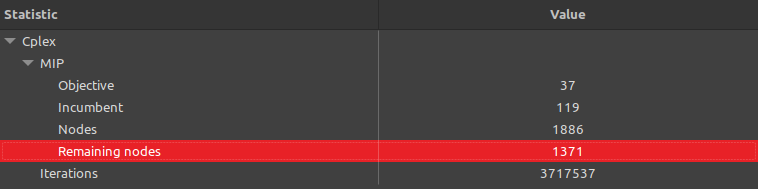
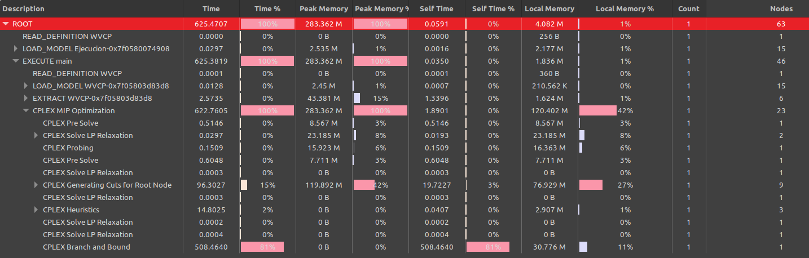
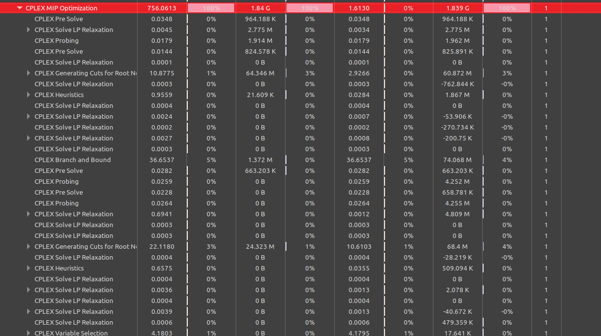
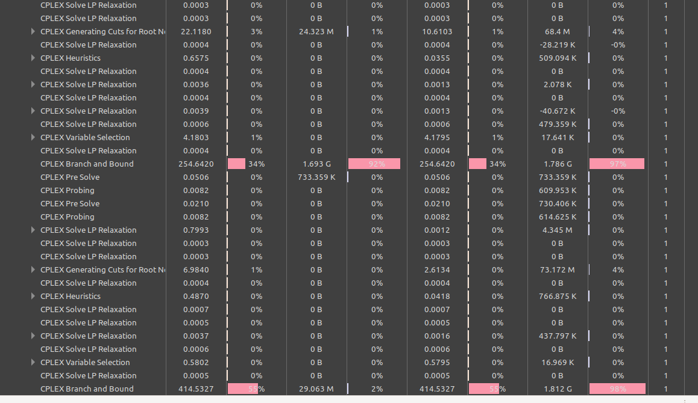
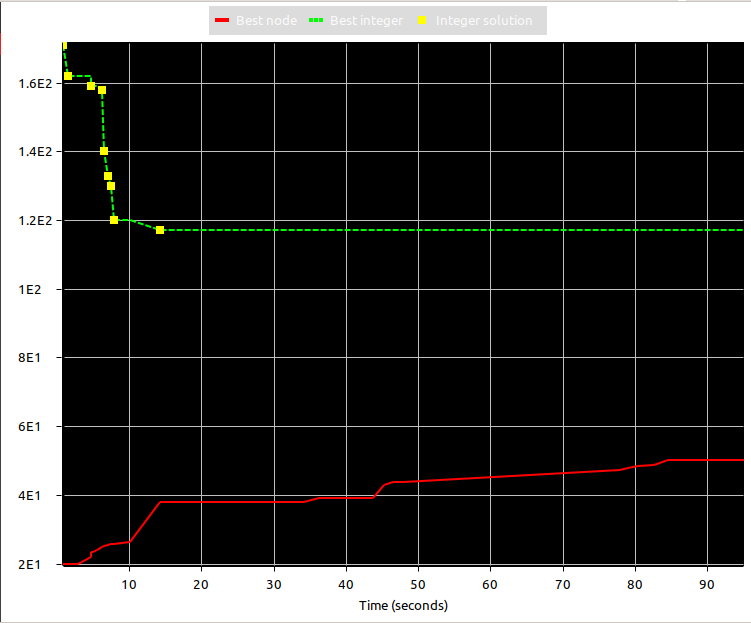
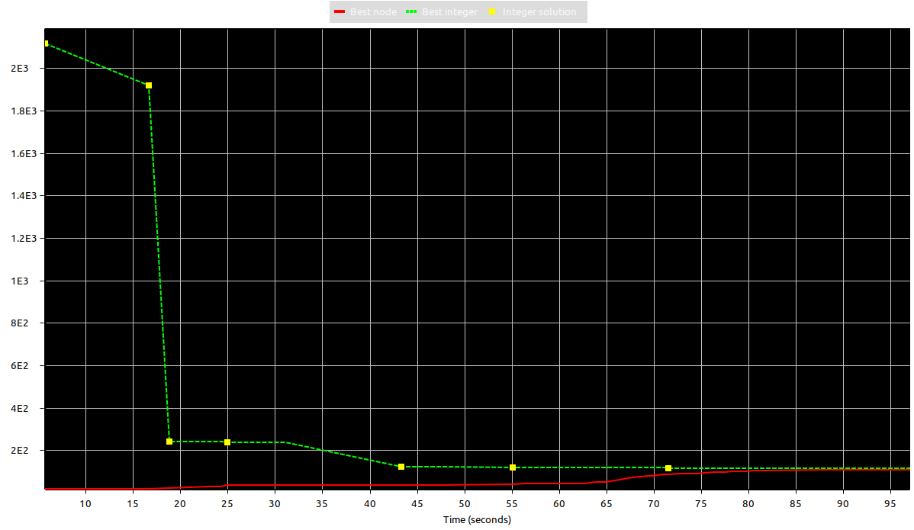
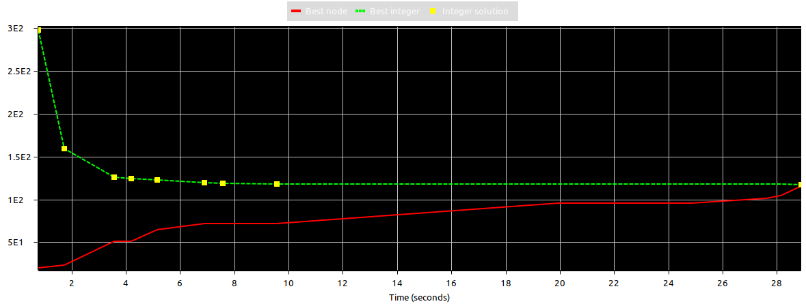

# Informe tercera entrega del TP
En esta sección se desarrollarán cada uno de los pasos indicados para la tercera entrega del TP.

### Paso 1
Al correr mi heurística sobre este tercer problema, obtuve el siguiente output:
```
$ time ./ejecutar.sh tercer
Lavado 1 -> Tiempo: 20
Lavado 2 -> Tiempo: 19
Lavado 3 -> Tiempo: 14
Lavado 4 -> Tiempo: 13
Lavado 5 -> Tiempo: 12
Lavado 6 -> Tiempo: 11
Lavado 7 -> Tiempo: 9
Lavado 8 -> Tiempo: 9
Lavado 9 -> Tiempo: 8
Lavado 10 -> Tiempo: 5
Lavado 11 -> Tiempo: 3
Tiempo total de lavado: 123
Cantidad total de lavados: 11

real    0m0,023s
user    0m0,017s
sys     0m0,006s
```
Como podemos ver la ejecución del script tardó 0.023s y arrojó un tiempo total de lavado de todas las prendas de 123 (sumatoria de los tiempos de cada lavado formado). Y la cantidad total de lavados armados fue de 11.

### Paso 2
Se corre el modelo de la materia en CPLEX.
Luego de 10 minutos de ejecución podemos ver que el header del output de la sección Engine Log mostró lo siguiente:
```
1 Version identifier: 22.1.1.0 | 2022-11-28 | 9160aff4d
2 Legacy callback                                  pi
3 Tried aggregator 1 time.
4 MIP Presolve eliminated 120467 rows and 0 columns.
5 MIP Presolve modified 12013 coefficients.
6 Reduced MIP has 34783 rows, 19182 columns, and 121915 nonzeros.
7 Reduced MIP has 19044 binaries, 138 generals, 0 SOSs, and 0 indicators.
8 Presolve time = 0,51 sec. (253,66 ticks)
9 Found incumbent of value 2760,000000 after 0,72 sec. (403,01 ticks)
10 Probing time = 0,15 sec. (12,13 ticks)
11 Tried aggregator 1 time.
12 Detecting symmetries...
13 Reduced MIP has 34783 rows, 19182 columns, and 121915 nonzeros.
14 Reduced MIP has 19044 binaries, 138 generals, 0 SOSs, and 0 indicators.
15 Presolve time = 0,60 sec. (391,75 ticks)
16 Probing time = 0,09 sec. (11,35 ticks)
17 Clique table members: 15739.
18 MIP emphasis: balance optimality and feasibility.
19 MIP search method: dynamic search.
20 Parallel mode: deterministic, using up to 8 threads.
21 Root relaxation solution time = 1,43 sec. (475,39 ticks)
```
Por lo que puedo entender, CPLEX hace un paso de pre-resolución del problema en el que reduce su tamaño.
Esto se puede intuir por la línea 4 del output, donde indica que eliminó 120467 filas (entiendo que representan las restricciones del modelo).
Se puede ver también que para encontrar la solución, CPLEX busca un balance entre optimalidad y compatibilidad (línea 18).
Aparentemente el método de búsqueda de la solución es "dynamic search" (línea 19).
Y finalmente se puede notar que CPLEX intenta paralelizar la resolución mediante el uso de hasta 8 threads de ejecución (línea 20).

Ahora miramos el resto del output de Engine Log:
```
        Nodes                                         Cuts/
   Node  Left     Objective  IInf  Best Integer    Best Bound    ItCnt     Gap

*     0+    0                         2760,0000        0,0000           100,00%
*     0+    0                         1467,0000        0,0000           100,00%
*     0+    0                          171,0000        0,0000           100,00%
      0     0       20,0000  4286      171,0000       20,0000       11   88,30%
*     0+    0                          161,0000       20,0000            87,58%
      0     0       20,0000  1567      161,0000     Cuts: 181     6970   87,58%
      0     0       20,0000  2225      161,0000    Cuts: 1498    17262   87,58%
      0     0       20,0000  1187      161,0000      Cuts: 58    19066   87,58%
*     0+    0                          143,0000       20,0000            86,01%
*     0+    0                          136,0000       20,0000            85,29%
      0     0  -1,00000e+75     0      136,0000       20,0000    19066   85,29%
      0     0       20,0000  1803      136,0000    Cuts: 1091    29019   85,29%
      0     2       20,0000   944      136,0000       20,0000    29019   85,29%
Elapsed time = 114,63 sec. (69300,89 ticks, tree = 0,02 MB, solutions = 6)
      1     3       37,0000  1063      136,0000       20,0000    35579   85,29%

                                            .
                                            .
                                            .

   1823  1244       78,0000   705      119,0000       37,0000  3329312   68,91%
   1841  1287      117,0000   230      119,0000       37,0000  3473375   68,91%
Elapsed time = 611,03 sec. (157482,84 ticks, tree = 16,90 MB, solutions = 26)
   1857  1279      100,1215   608      119,0000       37,0000  3446000   68,91%
```

De acuerdo a la documentación de CPLEX ("If no solution has been found, the column titled Best Integer is blank; otherwise, it records 
the objective value of the best integer solution found so far"), en la columna Best Integer estamos viendo cómo evoluciona el funcional
de la mejor solución entera hasta el momento (el menor tiempo total de lavado). Comienza con un valor de 2760 y rápidamente ya se pone en el orden de los 100.
Cada cierto tiempo también se logea el tamaño en MB que ocupa el árbol de soluciones para el modelo y cuántas soluciones se han encontrado
hasta ahora (las líneas que comienzan con "Elapsed time = ...").
Luego de unos 10 minutos aproximadamente corté la ejecución y se puede ver que el mejor valor del funcional (solución entera) que pudo encontrar hasta el momento fue de 119. Que traducido al problema de las prendas significa que el menor tiempo total de lavado de prendas encontrado fue 119. Si nos fijamos en la columna Gap, se nos muestra que la mejor solución encontrada es en el peor de los casos un 68.91% más alta que el óptimo real (lo cual es bastante malo).

Ahora miramos la sección Statistics:



Podemos ver lo que mencionamos antes, el Incumbent (el valor del funcional para la mejor solución entera encontrada) es de 119.
El total de iteraciones realizadas es altísima, como podemos ver llega a 3717537.

Y finalmente en la sección Profiler:



Se observa que el tiempo total de la ejecución fue de 625.47 segundos. Prácticamente no tarda nada en cargar el modelo y todo el tiempo lo consume la propia resolución.
Lo interesante está en las tareas que hace dentro de la optimización. Comienza con una pre-resolución del modelo como comenté antes. Luego realiza varias relajaciones (entiendo que es para poder resolver el problema primero como uno de programación lineal contínua).
Hay un momento que realiza "cortes" al nodo raíz (que entiendo que sería el modelo original del problema), esto consume un 15% del total del tiempo de ejecución.
También se aplican heurísticas, aunque no se especifiquen cuáles. Y por último vemos que utiliza la técnica de branch & bound para intentar resolver exactamente el problema. Aquí es con lo que se consume el 81% del tiempo total de la ejecución.

### Paso 3
Se ejecutó el modelo de la materia con un pequeño cambio, se limitó el número de lavados máximos a 15 (int limiteColores = 15, en el script), como dice el enunciado.
Luego de haberlo dejado corriendo por más de 10 minutos, lo aborté y los últimos resultados en Engine Log mostraron:
```
 127297 48521      114,0000   307      117,0000      106,0000 13435641    9,40%
Elapsed time = 689,18 sec. (303437,20 ticks, tree = 1578,41 MB, solutions = 14)
 128172 49054      114,0000   425      117,0000      106,0000 13532371    9,40%
 129274 49980      107,1429   379      117,0000      106,0000 13682493    9,40%
 130350 50638      110,8889   359      117,0000      106,0000 13786128    9,40%
 131395 51830      110,8140   398      117,0000      106,0000 13962982    9,40%
 132099 52558      109,8947   474      117,0000      106,0000 14106077    9,40%
 133121 52939      112,6260   303      117,0000      106,0000 14171125    9,40%
 134007 53704      109,0000   343      117,0000      106,0000 14306802    9,40%
```

Como vemos luego de correr durante 689.18 segundos el menor tiempo total de lavado (Best Integer) fue de 117, habiendo realizado más de 14 millones de iteraciones. Viendo el resultado de la columna Gap podemos darnos cuenta que gracias a este límite de lavados (o colores) que impusimos, CPLEX pudo llegar a una solución entera mejor que la anterior en más o menos el mismo tiempo (sabiendo que ninguna de las dos ejecuciones terminaron por sí solas). Lo interesante es que aunque la mejor solución entera encontrada haya mejorado solamente en 2, comparando con la del paso 2, la columna Gap nos dice que ahora está mucho más cerca del óptimo real que antes.

Ahora si miramos el principio de la ejecución notamos lo siguiente:
```
        Nodes                                         Cuts/
   Node  Left     Objective  IInf  Best Integer    Best Bound    ItCnt     Gap

*     0+    0                          300,0000        0,0000           100,00%
*     0+    0                          171,0000        0,0000           100,00%
      0     0       20,0000  1078      171,0000       20,0000     1897   88,30%
*     0+    0                          162,0000       20,0000            87,65%
      0     0       20,0000  1176      162,0000     Cuts: 386     2954   87,65%
      0     0       21,8697   964      162,0000     Cuts: 524     6105   86,50%
      0     0       23,2807  1000      162,0000     Cuts: 824     8583   85,63%
*     0+    0                          161,0000       23,2807            85,54%
*     0+    0                          159,0000       23,2807            85,36%
      0     0  -1,00000e+75     0      159,0000       23,2807     8583   85,36%
      0     0       23,8149   956      159,0000     Cuts: 764    11016   85,02%
      0     0       24,5334   862      159,0000     Cuts: 677    12941   84,57%
      0     0       24,7772   934      159,0000     Cuts: 658    13870   84,42%
*     0+    0                          158,0000       24,7772            84,32%
      0     0       25,0639  1060      158,0000     Cuts: 642    15044   84,14%
*     0+    0                          152,0000       25,0639            83,51%
*     0+    0                          149,0000       25,0639            83,18%
*     0+    0                          142,0000       25,0639            82,35%
*     0+    0                          140,0000       25,0639            82,10%
      0     0  -1,00000e+75     0      140,0000       25,0639    15044   82,10%
      0     0       25,3824  1005      140,0000     Cuts: 612    15948   81,87%
*     0+    0                          133,0000       25,3824            80,92%
      0     0       25,5203  1090      133,0000     Cuts: 545    16822   80,81%
      0     0       25,6527  1058      133,0000     Cuts: 441    17352   80,71%
*     0+    0                          130,0000       25,6527            80,27%
      0     0  -1,00000e+75     0      130,0000       25,6527    17352   80,27%
      0     0       25,7504  1035      130,0000     Cuts: 492    18010   80,19%
*     0+    0                          120,0000       25,7504            78,54%
      0     0       25,8975   950      120,0000     Cuts: 517    18760   78,42%
      0     0       25,9378   955      120,0000     Cuts: 430    19432   78,39%
      0     0       25,9804  1003      120,0000     Cuts: 459    20117   78,35%
      0     0       26,0081   973      120,0000     Cuts: 470    20810   78,33%
      0     0       26,0597   929      120,0000     Cuts: 404    21559   78,28%
      0     0       26,1165   922      120,0000     Cuts: 463    21973   78,24%
      0     0       26,1676  1020      120,0000     Cuts: 316    22587   78,19%
      0     0       26,7090   949      120,0000     Cuts: 316    24569   77,74%
      0     0       27,4955   891      120,0000     Cuts: 568    25721   77,09%
      0     0       28,1667   815      120,0000     Cuts: 595    26882   76,53%
      0     0       28,4914   767      120,0000     Cuts: 485    27619   76,26%
      0     0       28,5679   828      120,0000     Cuts: 440    28096   76,19%
      0     0       28,6490   836      120,0000     Cuts: 390    28630   76,13%
      0     0       28,7736   824      120,0000     Cuts: 428    29108   76,02%
      0     0       28,8233   839      120,0000     Cuts: 359    29559   75,98%
      0     0       28,8922   854      120,0000     Cuts: 272    29871   75,92%
      0     0       28,9014   818      120,0000     Cuts: 373    30213   75,92%
      0     0       28,9117   821      120,0000     Cuts: 228    30457   75,91%
      0     0       28,9190   833      120,0000     Cuts: 213    30706   75,90%
*     0+    0                          117,0000       28,9190            75,28%
      0     2       28,9190   772      117,0000       38,0000    30706   67,52%
Elapsed time = 12,47 sec. (6305,57 ticks, tree = 0,02 MB, solutions = 14)
      2     4       51,0000   559      117,0000       38,0000    32744   67,52%
```

Con tan solo los primeros 12 segundos de ejecución ya había llegado al menor valor del funcional de 117, con un total de 32744 iteraciones. Esto, en parte, se puede explicar porque ya la primera mejor solución entera encontrada fue de 300, muchísimo mejor que la del paso 2 (que era 2760).
Sin embargo el Gap era de 67.52% (entiendo que porque en comparación con los resultados de 10 minutos más tarde, acá no había recorrido tantas soluciones posibles y determinado tantas cotas superiores como lo hace después).

Además de esto, durante los 10 minutos de ejecución CPLEX hizo varios reinicios, siendo el primero a los 44 segundos aproximadamente:
```
Performing restart 1

Repeating presolve.
Tried aggregator 1 time.
MIP Presolve eliminated 124 rows and 60 columns.
Reduced MIP has 3821 rows, 2025 columns, and 13232 nonzeros.
Reduced MIP has 2010 binaries, 15 generals, 0 SOSs, and 0 indicators.
Presolve time = 0,03 sec. (15,58 ticks)
Tried aggregator 1 time.
Reduced MIP has 3821 rows, 2025 columns, and 13232 nonzeros.
Reduced MIP has 2010 binaries, 15 generals, 0 SOSs, and 0 indicators.
Presolve time = 0,02 sec. (12,70 ticks)
Represolve time = 0,17 sec. (62,37 ticks)
   3460     0       38,6525   704      117,0000     Cuts: 502   841298   62,53%
   3460     0       39,2241   748      117,0000     Cuts: 690   842921   62,53%
   3460     0       40,3638   772      117,0000     Cuts: 715   845710   62,53%
```

Además de estas particularidades, si nos fijamos en el header del output de Engine Log:
```
Version identifier: 22.1.1.0 | 2022-11-28 | 9160aff4d
Legacy callback                                  pi
Tried aggregator 1 time.
MIP Presolve eliminated 13053 rows and 0 columns.
MIP Presolve modified 1347 coefficients.
Reduced MIP has 3945 rows, 2085 columns, and 13532 nonzeros.
Reduced MIP has 2070 binaries, 15 generals, 0 SOSs, and 0 indicators.
Presolve time = 0,03 sec. (23,27 ticks)
Found incumbent of value 300,000000 after 0,06 sec. (37,25 ticks)
Probing time = 0,02 sec. (4,04 ticks)
Tried aggregator 1 time.
Detecting symmetries...
Reduced MIP has 3945 rows, 2085 columns, and 13532 nonzeros.
Reduced MIP has 2070 binaries, 15 generals, 0 SOSs, and 0 indicators.
Presolve time = 0,01 sec. (12,94 ticks)
Probing time = 0,04 sec. (4,04 ticks)
Clique table members: 1875.
MIP emphasis: balance optimality and feasibility.
MIP search method: dynamic search.
Parallel mode: deterministic, using up to 8 threads.
Root relaxation solution time = 0,17 sec. (155,55 ticks)
```

Con esto podemos ratificar que el modelo es mucho más pequeño que aquel sin la limitación de 15 lavados. Nos damos cuenta de esto con la cantidad de filas eliminadas por el presolver y también por la cantidad de filas resultantes para el problema reducido (3945 filas).

En cuanto al output del Profiler vemos lo siguiente:



Como observamos, del total del tiempo de ejecución que tomó la optimización, prácticamente todo lo acaparó la resolución por branch & bound, las 2 veces que se intentó.

Si miramos el gráfico de Statistics, podemos notar la evolución de las mejores soluciones contínuas encontradas (en rojo) en comparación con las mejores soluciones enteras (en verde).
Se puede ver que sus evoluciones son totalmente opuestas, las enteras comienzan arriba y bajan abruptamente hasta estabilizarse en cierto nivel. Y las contínuas lo hacen desde el punto más bajo y más progresivamente van mejorando (sin llegar a encontrarse con las enteras).



### Paso 4
Lo que primero se puede notar de esta ejecución es que a los 98 segundos frenó su ejecución. Esto lo podemos comprobar en la sección Scripting Log, que es la primera de las ejecuciones en la que aparece un output:
```
solution: 117 /size: 138 /time: 1718470566.830861092
Nodo 1: 1
Nodo 2: 1
Nodo 3: 1
Nodo 4: 1
Nodo 5: 1
Nodo 6: 5
...
```

Como vemos, se logea que la mejor solución entera encontrada fue 117, con un tamaño inicial de 138 (prendas en este caso). Además vemos a qué lavado corresponde cada prenda de la solución (con qué color se pintó cada nodo).

Si chequeamos la parte final de Engine Log vemos que llegamos a la solución de 117 pero ahora con un gap de 8.37%, que es incluso un poco más bajo que el del paso 3 (9.40%).
```
                                          ...
   6051   467       92,8716   289      117,0000      106,6080   353187    8,88%
   6572   814      111,0000   127      117,0000      106,6080   417941    8,88%
Elapsed time = 92,90 sec. (59714,31 ticks, tree = 1,60 MB, solutions = 25)
   7404   823       99,8906   212      117,0000      106,6080   487667    8,88%
   8718   689        cutoff            117,0000      107,2105   559601    8,37%
```

Ahora vemos el grafico de evolución de las mejores soluciones (Statistics):


Es interesante acá que en prácticamente el mismo período de tiempo que en el paso 3, acá las soluciones enteras y contínuas están mucho más cerca (casi convergen entre sí).

Finalmente si observamos el output de Scripting Log, podemos contar la cantidad de lavados diferentes que se usan en la solución. Con 11 lavados alcanza para agrupar las 138 prendas respetando las incompatibilidades (y eso que la restricción de 15 lavados se quitó para este paso).

### Paso 5
Lo más destacable de este paso es el tiempo en el que se alcanzó la mejor solución entera de 117.
Para esta ejecución le bastó a CPLEX con 28.5s de tiempo de optimización:


Si chequeamos el header de Engine Log notamos que el problema reducido tiene 3962 filas (restricciones) y 2085 columnas (variables):
```
Version identifier: 22.1.1.0 | 2022-11-28 | 9160aff4d
Legacy callback                                  pi
Tried aggregator 1 time.
MIP Presolve eliminated 13050 rows and 0 columns.
MIP Presolve modified 1350 coefficients.
Reduced MIP has 3962 rows, 2085 columns, and 13578 nonzeros.
Reduced MIP has 2070 binaries, 15 generals, 0 SOSs, and 0 indicators.
Presolve time = 0,04 sec. (23,33 ticks)
Found incumbent of value 300,000000 after 0,08 sec. (53,08 ticks)
Probing time = 0,02 sec. (4,05 ticks)
Tried aggregator 1 time.
Detecting symmetries...
Reduced MIP has 3962 rows, 2085 columns, and 13578 nonzeros.
Reduced MIP has 2070 binaries, 15 generals, 0 SOSs, and 0 indicators.
Presolve time = 0,01 sec. (12,66 ticks)
Probing time = 0,02 sec. (4,28 ticks)
Clique table members: 1878.
MIP emphasis: balance optimality and feasibility.
MIP search method: dynamic search.
Parallel mode: deterministic, using up to 8 threads.
Root relaxation solution time = 0,17 sec. (126,25 ticks)
```

Y si verificamos el final del output de Engine Log, notamos que el gap entre la solución encontrada y el óptimo real cayó al 2.29% (cada vez nos acercamos más):
```
   3445     0       91,4634   318      118,0000     Cuts: 192   243951   19,07%
   3445     2       91,4634   297      118,0000       95,4975   243953   19,07%
   3469     7        cutoff            118,0000       95,4975   249769   19,07%
Elapsed time = 21,17 sec. (9652,52 ticks, tree = 0,02 MB, solutions = 13)
   3753    62      112,0000   183      118,0000       95,4975   264961   19,07%
   5048   322      112,4348   211      118,0000       96,4398   305126   18,27%
*  7017   416      integral     0      117,0000      114,3163   358270    2,29%
```

### Paso 6
- Primero hay que decir que tanto en el paso 3 como el 5, se limita la cantidad de lavados posibles a 15. Esto indefectiblemente reduce complejidad al problema.
- El paso 3 contaba con 3945 restricciones y 2085 variables, mientras que el paso 5 con 3962 restricciones y 2085 variables. Esto tiene completo sentido ya que lo único que hacemos en el paso 5 es agregar las restricciones de simetría al modelo.
- El paso 3 se ejecutó indefinidamente hasta que lo aborté manualmente, en cambio el paso 5 en 28.5s terminó su ejecución. Se puede entender esto por el hecho de que en el paso 3 el espacio de soluciones a explorar está menos reducido que el del 5, y por lo tanto requiere muchas más iteraciones para llegar a una misma mejor solución entera.
- Otro aspecto interesante a destacar es el gap entre la mejor solución encontrada por el paso 3 (fue de 9.4% al momento de abortarlo) y el gap para la misma solución en el paso 5 (fue de 2.29%). Bastante más cerca estuvo el paso 5 de su solución óptima real que el paso 3.

Luego de comparar los pasos 3 y 5 voy a pasar a realizar la misma comparación pero modificando ambos para que la restricción de lavados posibles sea igual a 11.

- Obviamente la mejor solución entera obtenida para los nuevos pasos 3 y 5 se mantuvo igual (117).
- El nuevo paso 3 cuenta con 2923 restricciones y 1529 variables, mientras que el nuevo paso 5 tiene 2935 y 1529 respectivamente.
- El nuevo paso 3 se ejecutó indefinidamente hasta que lo aborté manualmente, en cambio el nuevo paso 5 en 11.9s terminó su ejecución.
- El gap de la mejor solución del nuevo paso 3 fue de 8.55% y el del nuevo paso 5 fue de 2.30%.
- La primera mejor solución entera obtenida con el nuevo paso 3 y 5 fue de 220.

### Paso 7
Para la comparación voy a utilizar la solución obtenida del modelo de la materia con un límite de 11 lavados y con las restricciones de simetría descomentadas.

Con mi heurística, para este set de datos obtuve un tiempo total de lavado de 123, distribuído en 11 lavados. En cambio, con el modelo de la materia resuelto con CPLEX obtuve un tiempo total de lavado de 117, distribuído en 11 lavados. Con esta comparación podemos notar la utilidad del uso de heurísticas para el caso de problemas demasiado complejos en los que el tiempo de cómputo es un factor limitante. Con mi heurística tuve un resultado bastante bueno (a 6 del mejor resultado de CPLEX) en tan solo 0.023s. Por más que no sea el resultado óptimo real, se puede considerar un buen resultado para el tiempo en el que lo obtuve.

# Informe final del TP
Comencé la primera entrega del TP pensando que el problema a resolver era bastante sencillo. Lo era en parte, porque a medida que me fui metiendo más en los criterios que debía seguir para decidir el orden en el que probaba cada prenda en cada lavado, fui entendiendo que ninguna de mis estrategias me aseguraba que siempre me vaya a dar el menor tiempo posible. Al principio pensé que el orden en que iba iterando sobre las prendas era irrelevante, hasta que se me ocurrió probar con aquellas que más tiempo de lavado tenían, primero. Como esto mejoró bastante el resultado entendí que los criterios y reglas para elegir, necesitaban ser pensados un poco más en profundidad.
A medida que fue avanzando la materia y dimos el problema combinatorio de coloreo de grafos y su complejidad de cálculo, entendí que el problema de las prendas tenía algo que ver con eso. Durante la segunda entrega también entendí, al ver los distintos resultados de mis compañeros en la página de entrega del TP, que no hay una única forma de plantear una heurística para este problema. Había bastante diversidad de resultados. Y entiendo que detrás de cada uno hay maneras distintas de encarar el problema y de definir los criterios y reglas que se siguen en el algoritmo. También me di cuenta, consultando con compañeros, que algunos de ellos habían intentado ir al principio por un enfoque de fuerza bruta para el algoritmo. Creo que inconscientemente bloqueé esa posibilidad desde el comienzo porque me parecía poco eficiente (aunque en realidad podría haber sido una solución válida si este fuese otro tipo de problema).

Finalmente, luego de haber dado heurísticas en la teórica pude entender que el algoritmo que había diseñado para la primera entrega no era otra cosa que una heurística de construcción para un problema de coloreo de grafos (maquillado de otra cosa). Con sus criterios y reglas heurísticas (por más precarias que fueran).
